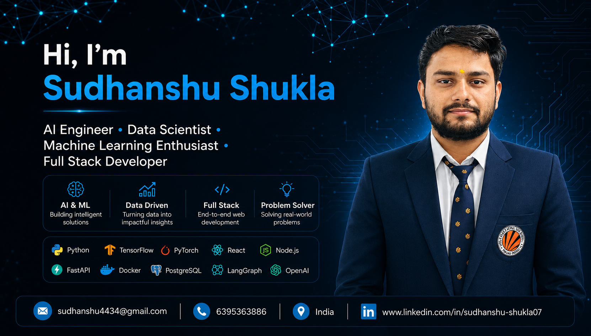

  

<h1 align="center">Hi 👋, I'm Sudhanshu Shukla</h1>

<h3 align="center">
AI Engineer • Data Scientist • Full Stack Developer
</h3>

Passionate about building intelligent AI applications using Machine Learning, Generative AI, LLMs, RAG, and Full Stack Development.

  

---

## 🌐 Connect With Me

  

  

  

  

  

📍 India &nbsp;&nbsp;|&nbsp;&nbsp;
🎓 B.Tech CSE Student &nbsp;&nbsp;|&nbsp;&nbsp;
🤖 AI & Machine Learning Enthusiast

---

# 👨‍💻 About Me

- 🎓 B.Tech Computer Science Engineering Student
- 🤖 Passionate about **Artificial Intelligence, Machine Learning & Data Science**
- 🌱 Currently learning **Generative AI, LLMs, LangGraph, RAG & MLOps**
- 💻 Building real-world AI applications using **Python, React, Node.js & FastAPI**
- 🚀 Interested in **AI Agents, Full Stack Development & Cloud Technologies**
- 📚 Solving **Data Structures & Algorithms** problems regularly
- 🎯 Goal: Become an **AI Engineer** and build impactful AI products
- ⚡ Fun Fact: I enjoy turning innovative ideas into real-world AI solutions.

---

# 💻 Tech Stack

## 👨‍💻 Programming Languages

  

## ⚛️ Frontend Development

  

## 🚀 Backend Development

  

## 🤖 AI / Machine Learning

  

## 🗄️ Databases

  

## ☁️ Cloud & DevOps

  

## 🛠️ Tools & IDEs

  

---

# 🚀 Featured Projects

<table>
<tr>

<td width="50%">

### 🩺 Smart Calander and Event Management System

A command-line calendar generator built using Linked List, Stack, Queue, and Array to efficiently manage and display all 12 months and 365+ days. The project features optimized C++ logic that boosts execution speed by 35% and reduces memory usage by 20%.

**Tech Stack:**  
Python • Advanced Data Structures • Alogorithms • Pandas • NumPy

🔗 **GitHub:** 
https://github.com/SudhanshuShukla07/DSA-Based-Command-Line-Calendar-Generator

</td>

<td width="50%">

### 📈 Cash Flow Minimizer

Cash Flow Minimizer is a C++17 application that optimizes debt settlement among a group of people by reducing the number of transactions required. It uses a hybrid approach combining Greedy algorithms and DFS Backtracking for efficient, accurate, and scalable balance settlement.

**Tech Stack:**  
DFS • Backtracking • Greedy Algorithms • Branch & Bound • CMake • Git

🔗 **GitHub:**  
https://github.com/SudhanshuShukla07/cash-flow-minimizer

</td>

</tr>

<tr>

<td width="50%">

### ☕ Hepatitis C Clinical Data Analysis Dashboard

Health dashboard and disease insights using Python, Excel, and data visualization.

**Tech Stack:**  
Python • Pandas • Matplotlib • Excel

🔗 **GitHub:**  
https://github.com/SudhanshuShukla07/Clinical-Data-Visualization-Hepatitis-C-Insights

</td>

<td width="50%">

### ✈️ Airline Passenger Satisfaction Dashboard

Excel dashboard analyzing customer satisfaction using pivot tables, slicers, KPIs, and charts.

**Tech Stack:**  
Python • MS Excel • Pandas 

🔗 **GitHub:**  
(Add link)

</td>

</tr>
</table>

---

# 📊 GitHub Analytics

  

  

---

# 🐍 Contribution Snake

  

---

